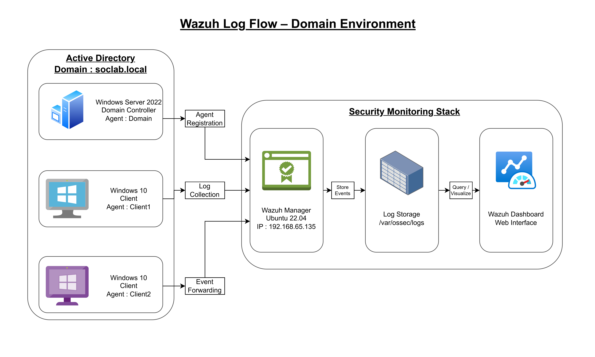
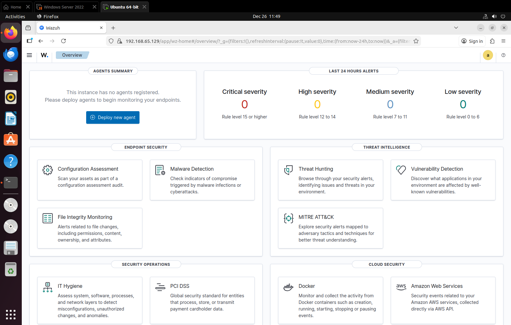
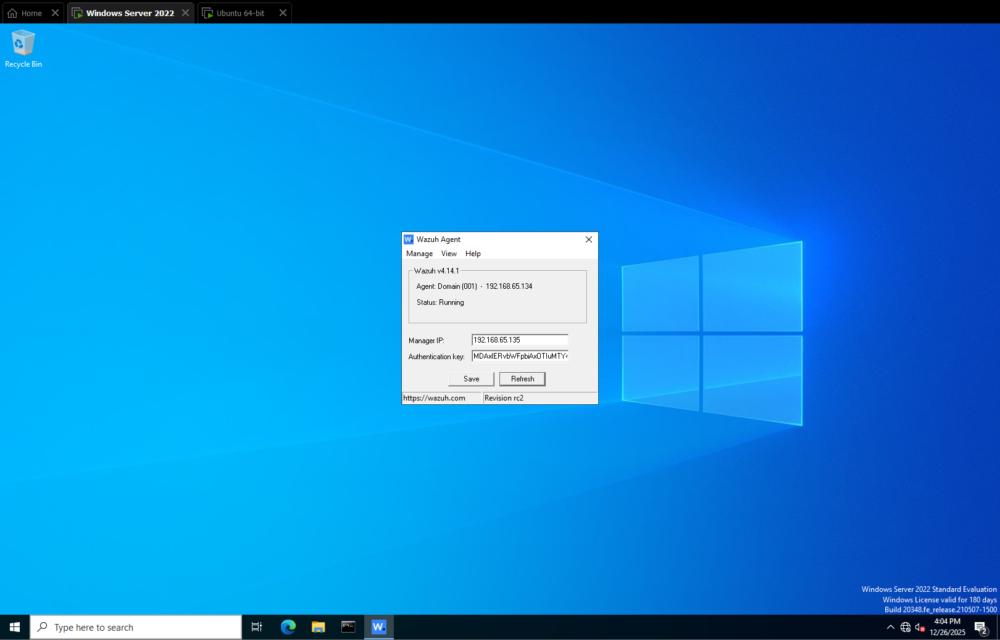
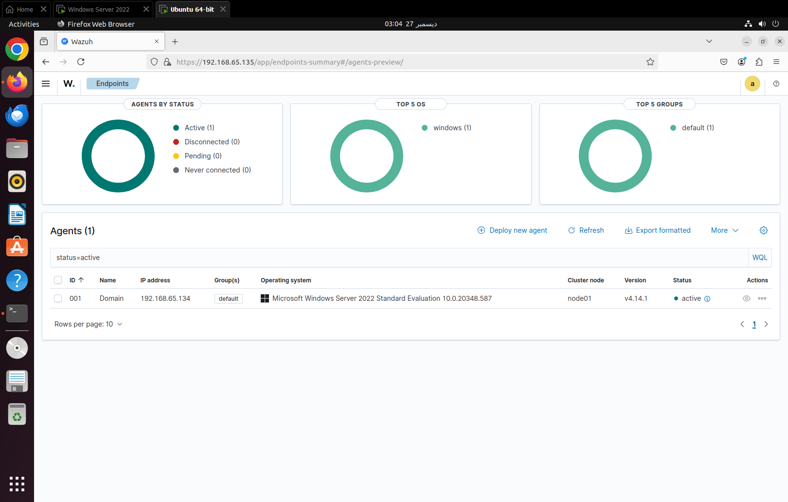
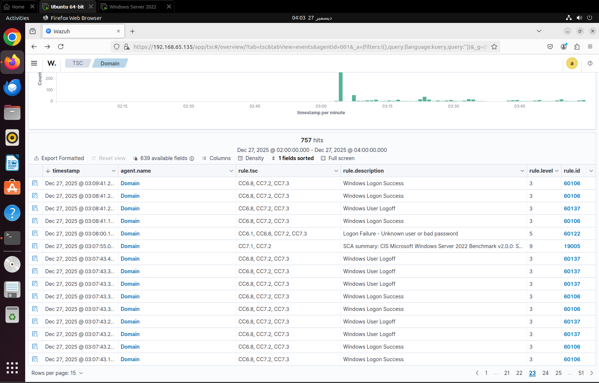
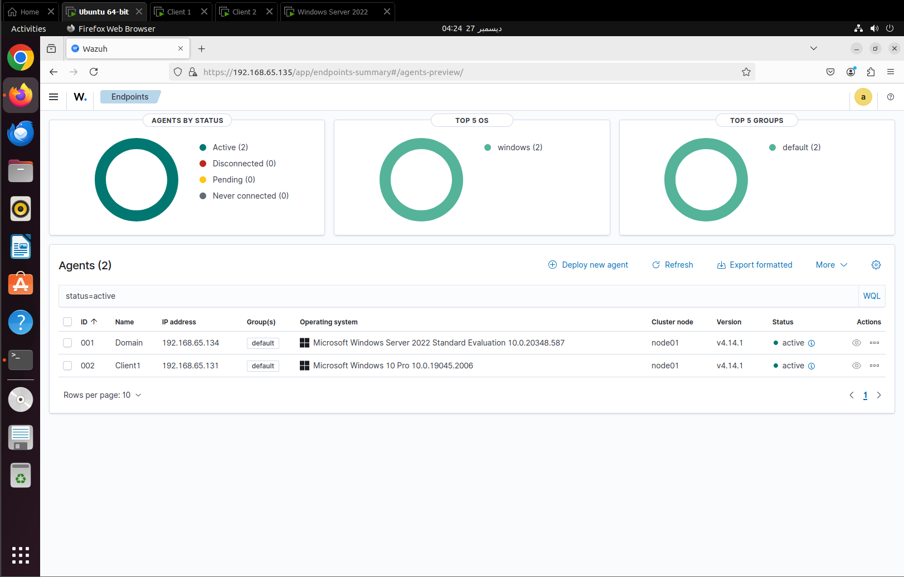
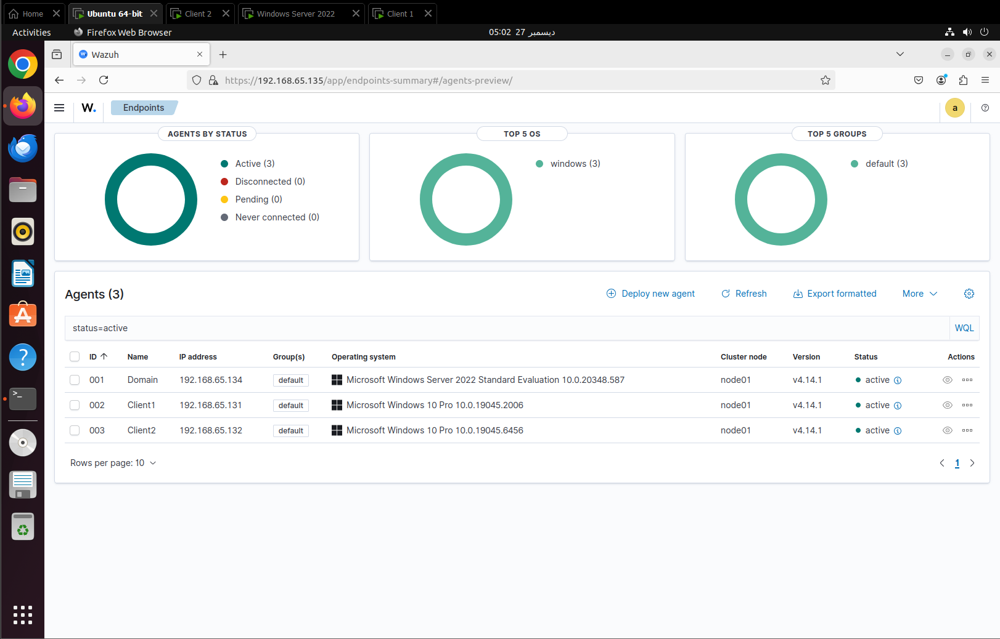
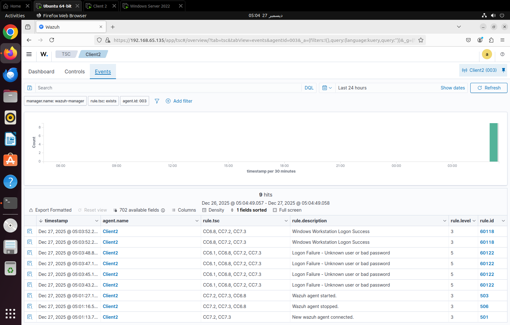

# Mini-Task-03: Endpoint Log Ingestion into Wazuh (Windows Server & Domain Clients)

## Description
This mini task documents the process of connecting Windows domain systems to Wazuh and verifying that security logs are successfully sent to a central SIEM. The focus of this task is to confirm visibility of authentication-related events from both servers and user endpoints.

This task does not include attack simulations or alert creation. It is focused only on log ingestion and validation.

---

## Architecture Diagram

### Wazuh Log Flow – Domain Environment

Windows systems forward security logs to the Wazuh Manager for centralized monitoring.

---

## Lab Environment

### SIEM / Observer
- Ubuntu Linux
- Wazuh Manager
- Wazuh Dashboard

### Endpoints
- Windows Server 2022 (Domain Controller)
- Windows 10 Client 01 (Domain joined)
- Windows 10 Client 02 (Domain joined)

All systems are connected within the same isolated lab network.

---

## Step-by-Step Process and Evidence

### Step 1: Verify Initial State (No Agents Connected)
Before onboarding any endpoints, the Wazuh Dashboard was checked to confirm that no agents were currently connected.

**Screenshot:**

This confirms a clean starting state.

---

### Step 2: Configure Wazuh Agent on Windows Server 2022
The Wazuh agent was installed on the Windows Server 2022 domain controller. The agent was configured with the IP address of the Ubuntu Wazuh Manager and assigned a clear hostname.

**Agent Name:**
- `Domain`

**Screenshot:**

---

### Step 3: Confirm Windows Server Agent Connection
After starting the Wazuh agent service, the dashboard was checked to confirm that the server appeared as active.

**Screenshot:**

This confirms that the domain controller is successfully connected to the SIEM.

---

### Step 4: Validate Authentication Logs from Windows Server
A failed login attempt was generated on the Windows Server to test log ingestion. The authentication event was then verified in the Wazuh Dashboard.

**Screenshot:**

This confirms end-to-end log flow from the domain controller to Wazuh.

---

### Step 5: Onboard Windows 10 Client 01
The Wazuh agent was installed and configured on the first Windows 10 domain client.

**Agent Name:**
- `Client1`

**Screenshot:**

This confirms the first client endpoint is reporting to Wazuh.

---

### Step 6: Onboard Windows 10 Client 02
The same process was repeated for the second Windows 10 domain client.

**Agent Name:**
- `Client2`

**Screenshot:**

At this stage, all three endpoints are active in the dashboard.

---

### Step 7: Validate Authentication Logs from Windows 10 Client2
A failed login attempt was generated on a Windows 10 client and the corresponding authentication event was observed in Wazuh.

**Screenshot:**

This confirms visibility of user authentication activity from client endpoints.

---

## Scope and Limitations

This mini task validates only Windows authentication logs.

The following items are not covered:
- Process creation logging
- PowerShell logging
- Network traffic monitoring
- Detection rules and alerting

These will be addressed in later SOC lab tasks.

---

## Outcome

At the end of this mini task:
- Windows Server and Windows 10 domain clients are connected to Wazuh
- Authentication logs are centrally visible in the SIEM
- Basic endpoint visibility is confirmed for the SOC

This completes the log ingestion foundation required for future detection and attack simulation work.
