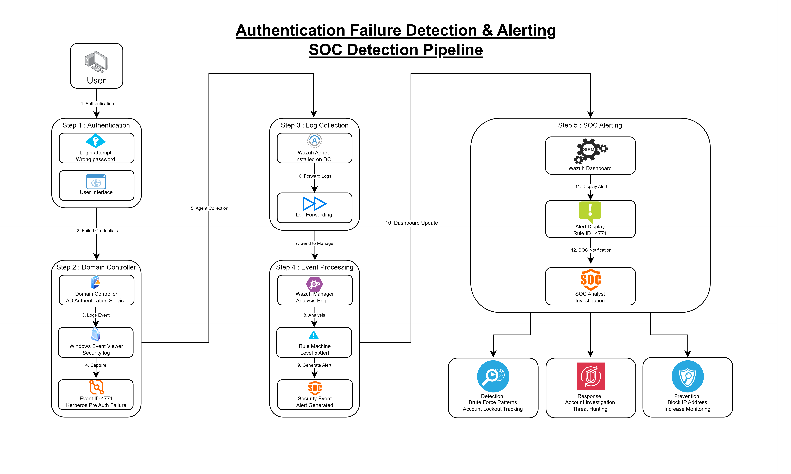
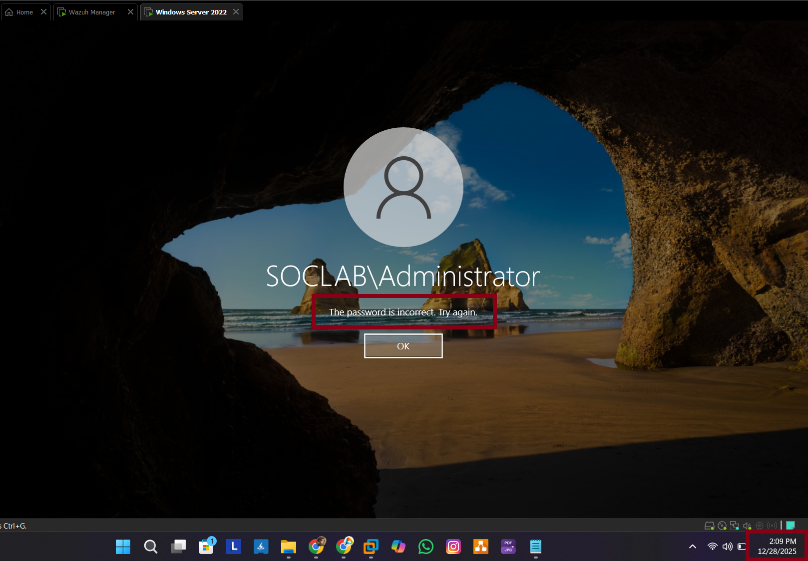
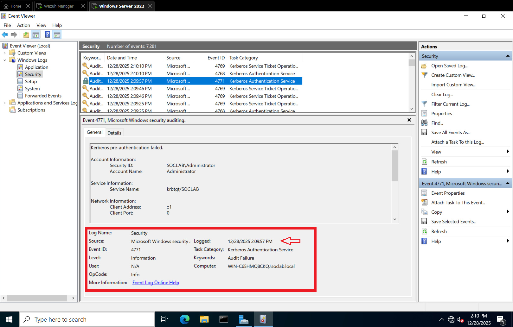
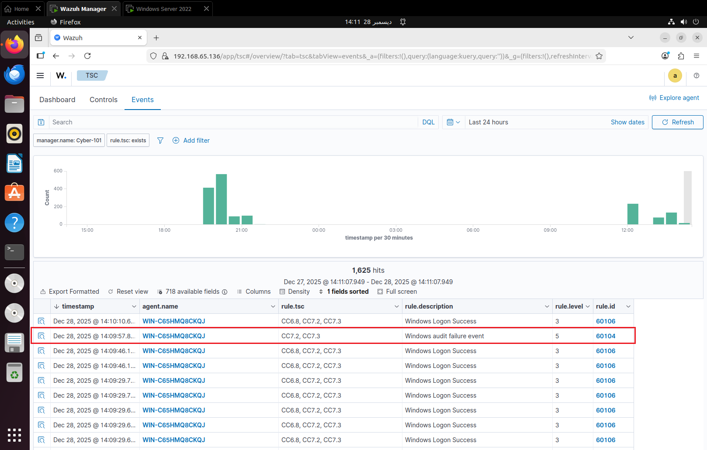

# Mini Task 4 – Authentication Failure Dectection & Alerting

## Objective
This task focuses on validating that failed login attempts on the domain controller are correctly captured and reported by Wazuh. We will generate Kerberos authentication failures and track the events from the Windows Event Viewer to the Wazuh dashboard.

## Description
In previous tasks, we observed Event ID **4771** for Kerberos authentication failures directly on the domain controller. In this task, we extend that by confirming that Wazuh correctly ingests and displays these events as security alerts. This is essential for validating SOC lab's alerting and monitoring workflow.

## Steps Performed

1. Opened VMware and launched two VMs:
   - **Domain Controller (DC)** – 192.168.65.134
   - **Wazuh Manager** – 192.168.65.136
2. Generated failed login attempts on the domain controller by entering the wrong password at **14:09, 28 Dec 2025**.
3. Opened **Server Manager → Tools → Event Viewer → Windows Logs → Security** and located Event ID **4771**.
4. Verified the Kerberos audit failure with details:
   - Agent IP: 192.168.65.134
   - Event ID: 4771
5. Navigated to **Wazuh Manager → Security Events** and confirmed the event appeared with **Rule Level 5**.
   - Agent IP: 192.168.65.134
   - Event ID: 4771
   - Channel: Security
   - Event Record ID: 7279
   - Description: Kerberos pre-authentication failed
   - Security Level: Audit Failure
   - Thread ID: 4092
   - Rule: cc7.2 / cc7.3
6. I used Wazuh to detect a Kerberos pre-authentication failure (Event ID 4771) on a Domain Controller. I analyzed the 0x18 status code to identify it as a likely bad password attempt and investigated the source IP to determine if it was an isolated typo or a brute-force attack.
7. Captured screenshots for documentation:
   1. Failed login attempt with timestamp.
   2. Event Viewer entry showing Event ID 4771.
   3. Event visible in Wazuh Manager.
   4. Alert details in Wazuh dashboard.

## Outcome
Failed login attempts on the domain controller were successfully captured and logged in Wazuh, confirming that the alerting and monitoring system is operational. This task validates the SOC lab's ability to detect authentication failures.

## Recommendation
If 5+ instances of Event 4771 occur within 1 minute for a single user, the account should be temporarily locked, and the source IP should be investigated for potential brute-force activity.

## Diagram – Failed Domain Login Event Flow

This diagram illustrates the end-to-end flow of a failed authentication attempt in the lab environment, from the initial login failure on the domain controller to alert generation in Wazuh.

The process begins when an incorrect password is entered on the domain controller. Windows records the Kerberos authentication failure as Event ID 4771 in the Security log. This event is then collected by the Wazuh agent and forwarded to the Wazuh manager, where it is analyzed, classified, and displayed as a security alert in the dashboard.

This visual confirms that authentication-related security events are successfully monitored and correlated across the environment.

## Screenshot Evidence – Event Validation

### Screenshot 1: Failed Domain Login Attempt  

This screenshot shows a failed login attempt on the domain controller caused by entering an incorrect password. The timestamp of the attempt is visible and serves as the starting point for validating event correlation across systems.

---

### Screenshot 2: Kerberos Authentication Failure in Event Viewer  

This screenshot captures Event ID **4771** in the Windows Security log on the domain controller. The event confirms a Kerberos pre-authentication failure and includes key metadata such as event ID, security level (Audit Failure), and time of occurrence.

---

### Screenshot 3: Event Visible in Wazuh Security Events  

This screenshot shows the same authentication failure ingested by Wazuh and displayed under Security Events. The event appears with a rule level of 5, confirming that Wazuh is successfully collecting and analyzing Windows security logs.

---

### Screenshot 4: Wazuh Alert Details  

This screenshot displays the detailed alert view in the Wazuh dashboard. It includes the agent IP, event ID 4771, security channel, event description, and associated compliance rules. This confirms full visibility and alert generation for failed authentication attempts.

