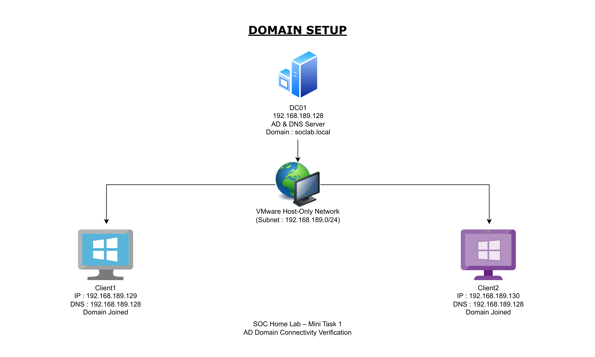

# Mini Task 1 – Active Directory Domain Setup & Connectivity

## Objective

Set up a basic Active Directory lab by installing AD DS on a Domain Controller and establishing network connectivity between the DC and two Windows clients.

---

## Lab Setup

### Domain Controller
- **Name:** DC01  
- **OS:** Windows Server 2022  
- **Role Installed:** Active Directory Domain Services (AD DS) & DNS  
- **IP Address:** `192.168.189.128`  
- **Domain:** `soclab.local`  

### Clients
- **Client1**
  - IP: `192.168.189.129`
  - DNS: `192.168.189.128`
  - Domain Joined

- **Client2**
  - IP: `192.168.189.130`
  - DNS: `192.168.189.128`
  - Domain Joined

---

## Network Configuration

- **Platform:** VMware  
- **Network Type:** Host-Only Network  
- **Subnet:** `192.168.189.0/24`  
- **IP Type:** Static  

All virtual machines were configured on the same Host-Only network to simulate an internal enterprise environment.

---

## Diagram

---

## Issue & Fix

Initially, NAT and Host-Only networks were mixed, causing inconsistent IP ranges and connectivity issues.

**Resolution:**
- Identified the IP pattern mismatch
- Reconfigured all VMs to use **Host-Only**
- Assigned static IPs within the same subnet
- Set client DNS to the Domain Controller

---

## Verification

- Active Directory Domain Services installation
- Connectivity tested using ICMP ping
- Packets were successfully sent and received between clients and DC

---

## Result

- AD DS installed successfully
- Stable network communication established
- Clients joined to the domain
- Lab ready for further Active Directory and SOC tasks

