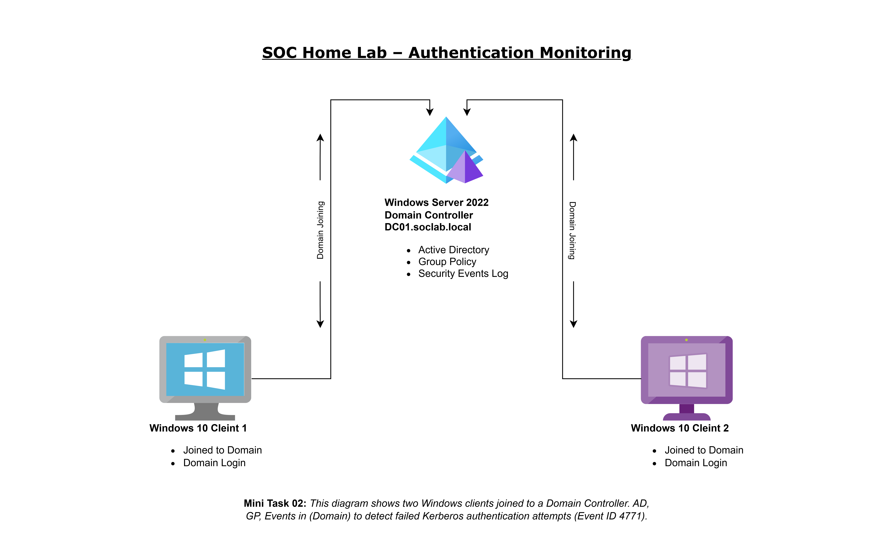
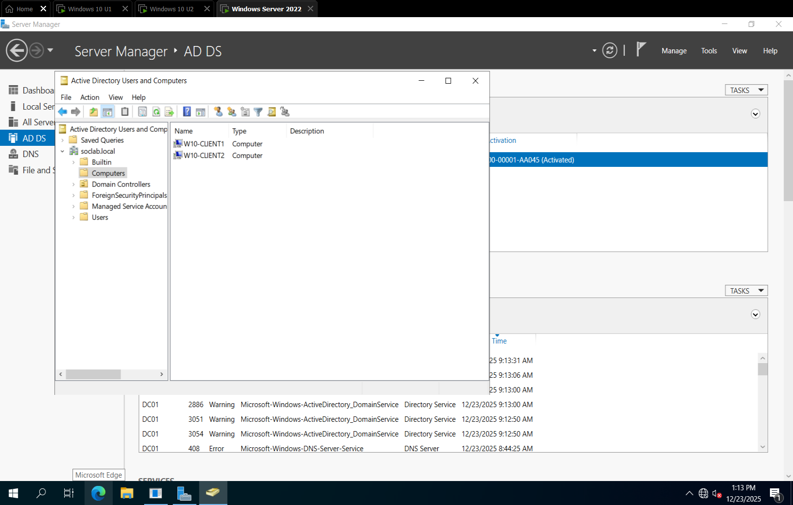
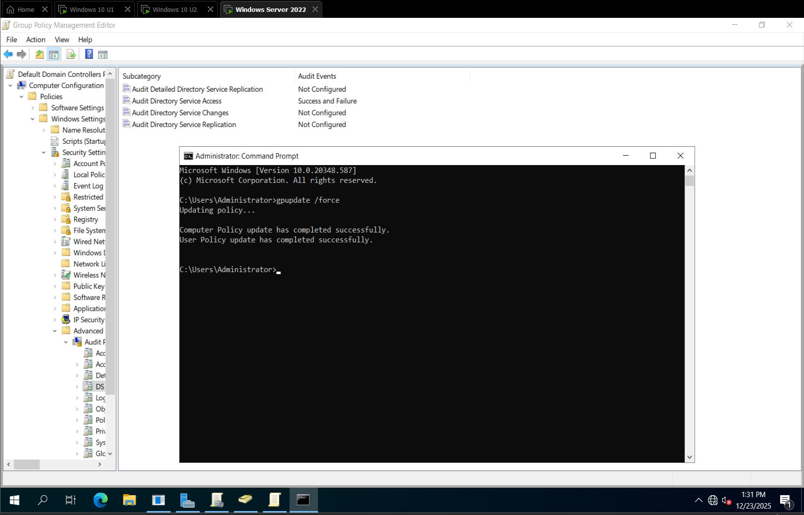

# SOC Mini Task 02 – Kerberos Authentication Failure Detection (Event ID 4771)

## Mini Task 02

*Two Windows clients were joined to a Domain Controller. Failed Kerberos authentication attempts were simulated and detected on the Domain Controller only.*

---

## Objective

The objective of this mini task is to simulate and detect failed domain authentication attempts in a Windows Active Directory environment by analyzing Kerberos authentication logs **on the Domain Controller**.  

The Windows clients were only joined to the domain to provide a complete AD environment; they did not generate events themselves.

---

## Lab Environment

| Component         | Details                        |
| ----------------- | ------------------------------ |
| Domain Controller | Windows Server 2022            |
| Domain Name       | DC01.soclab.local              |
| Client Machines   | 2 × Windows 10 (joined only)   |
| Services Used     | Active Directory, Group Policy |
| Logs Analyzed     | Windows Security Event Logs (on DC) |
| Network Type      | SOC Home Lab                   |

---

## Lab Architecture Diagram

**Diagram One-Liner:** Two Windows clients joined to a Domain Controller where authentication is monitored centrally.

---

## Steps Performed

### 1. Domain Joining

* Both Windows 10 clients were joined to the domain `soclab.local`.
* Domain join was confirmed on the clients.

**Evidence:**

---

### 2. Active Directory Verification

* Logged into the Domain Controller.
* Verified both client machines appeared under:

  * **Active Directory Users and Computers → Computers**

**Evidence:**

---

### 3. Group Policy Update

* Applied Group Policy changes on the Domain Controller.
* Forced policy update using CMD

## 4. Failed Authentication Simulation on DC

* On the Domain Controller, a login attempt was made using an incorrect password for a domain account.
* This triggered Kerberos pre-authentication failure logs (Event ID 4771).

**Evidence:**

---

## 5. Log Analysis (Detection)

* Accessed **Event Viewer → Windows Logs → Security** on the Domain Controller.
* Identified Kerberos authentication failure logs.

**Detected Event Details:**

| Field         | Value                          |
| ------------- | ------------------------------ |
| Event ID      | 4771                           |
| Event Type    | Audit Failure                  |
| Source        | Kerberos Authentication Service|
| Domain        | DC01.soclab.local              |

**Evidence:**

---

## Findings

* Failed domain authentication attempts are logged centrally on the Domain Controller.
* Event ID 4771 indicates Kerberos pre-authentication failures.
* Logs can help SOC analysts detect:
  * Brute-force attempts targeting domain accounts
  * Compromised accounts with repeated incorrect login attempts
* The clients did not generate events; all monitoring and detection were performed on the DC.

---

## Conclusion

This mini task demonstrated how to simulate failed Kerberos authentication on the Domain Controller and detect them via Event ID 4771.

**Key Takeaways:**

* Clients only need to be domain-joined; detection happens at the DC.
* Centralized logging allows SOC teams to monitor authentication failures effectively.
* Event ID 4771 is useful for identifying brute-force attempts and compromised accounts in an Active Directory environment.

---

## References

* Microsoft Docs – Event ID 4771
* Windows Security Logging Best Practices
* SOC Analyst Learning Resources – Active Directory Monitoring

