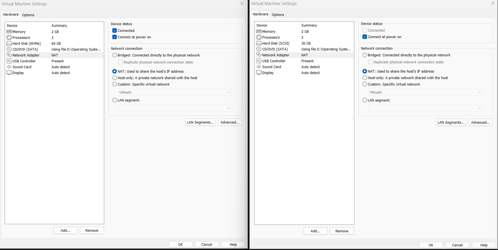
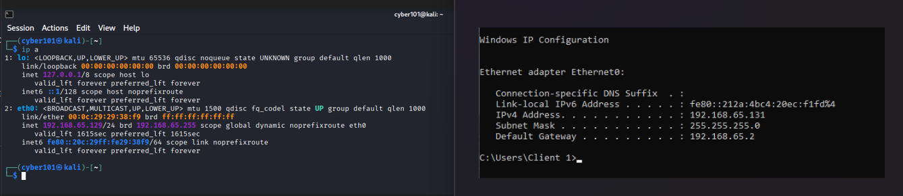
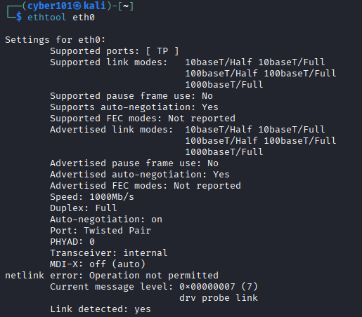
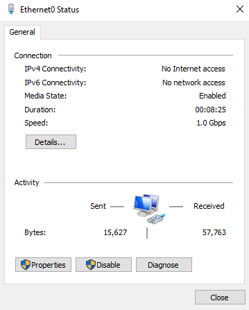
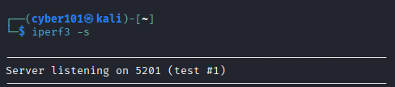
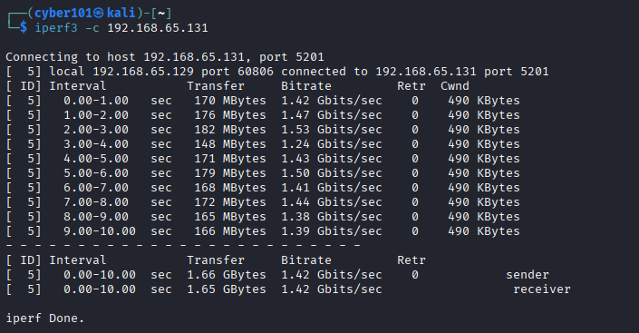

# Mini Task 5: Bandwidth vs Throughput Measurement

**Course Context:**  
This task was performed as part of the **CCST Cybersecurity course**. During the course, the concepts of **bandwidth** and **throughput** were covered, and this hands-on mini task was executed to reinforce learning by measuring real network performance in a lab setup.

---

## Objective

The goal of this task was to:

1. Measure the **link speed (bandwidth)** of a network interface.
2. Measure the **actual throughput** between two machines.
3. Compare theoretical bandwidth and measured throughput.
4. Understand practical implications for **SOC operations**, network monitoring, and troubleshooting.

---

## Lab Environment

- **Kali Linux VM (Client)**: 192.168.65.129  
- **Windows VM (Server)**: 192.168.65.131  
- Both machines are connected via a **host-only virtual network**.  
- The lab setup simulates a controlled network environment suitable for SOC testing.

---

## Step 1: Measure Network Interface Bandwidth

On the Kali Linux client, the network interface was checked using `ethtool eth0`. The results showed:

- Speed: 1000 Mb/s (1 Gbps)  
- Duplex: Full  
- Link detected: Yes  

**Screenshot 3 placeholder**  

**SOC relevance:** Knowing the theoretical maximum bandwidth helps analysts identify potential network bottlenecks and understand the limits of the interface for monitoring traffic.

---

## Step 2: Start iperf3 Server on Windows

On the Windows server, `iperf3` was started in server mode with the command `.\iperf3.exe -s`. The server output indicated it was listening on port 5201. The Windows firewall was configured to allow iperf3 traffic on private networks.  

**Screenshot 4 placeholder**  

**Note:** The server must remain running throughout the test to measure client throughput. This step replicates a real-world scenario where SOC analysts monitor server-client traffic to measure performance and detect potential issues.

---

## Step 3: Measure Real Network Throughput

From the Kali Linux client, the throughput was measured using `iperf3 -c 192.168.65.131`. The observed throughput over a 10-second interval averaged approximately 1.5 Gbps, with individual intervals showing minor fluctuations due to network behavior in a virtualized environment.  

**Screenshot 5 placeholder**  

**SOC relevance:**  
- Shows real-world network throughput compared to theoretical bandwidth.  
- Highlights the difference between link speed and actual performance.  
- Helps analysts understand network efficiency and troubleshoot slow links or congestion.

---

## Notes

- Earlier loopback tests (`127.0.0.1`) were performed to verify iperf3 functionality, but these do not represent real network throughput.  
- Measured throughput slightly exceeding 1 Gbps is normal due to **virtual machine optimizations and virtual NIC behavior**.  
- This task simulates a controlled SOC environment where performance metrics are analyzed for monitoring and troubleshooting.

---

## Summary

- **Link Speed (Bandwidth):** 1 Gbps  
- **Measured Throughput:** ~1.5 Gbps between Kali client and Windows server  
- Demonstrates practical understanding of **bandwidth vs throughput** in a virtualized lab setup  
- Provides SOC-relevant insight into network performance measurement, analysis, and monitoring

---

**Screenshots included:**  
- Screenshot 1: Lab Network Configuration
  

  
- Screenshot 2: Ip Address Verification
  

  
- Screenshot 3: Link Speed Bandwidth Linux
  

  
- Screenshot 3: Link Speed Bandwidth Windows
  

  
- Screenshot 4: iperf3 server running
  

  
- Screenshot 5: iperf3 client throughput measurement
  

  

